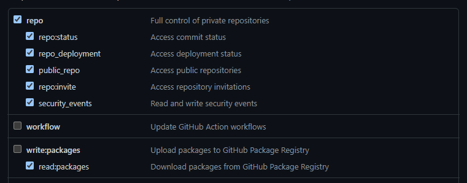

# Philosophy

Due to the short-comings of GitHub Actions as a product (decsribed below), you have to write Actions in somewhat convoluted ways and deal with lots of frustrating issues and workarounds. The products of this repo, however, should be easy to use and any problems that GitHub causes need to be absorbed here, not passed down to other repos, whenever that's reasonable. At the end of the day, it's easier to update these files than to push changes out to all the repos we have.

# Structure

# The Problems With GitHub Actions

IMO, GitHub was created with open source development in mind and the enterprise focused producs (private repos, organizations) were slapped on as an MVP product that they're still working through. So, you'll encounter plenty of things that just don't really work or make sense if you're an enterprise user. Please excuse my snark while I document these for future generations:

## GITHUB_TOKEN doesn't work in any meaningful way

[GITHUB_TOKEN](https://docs.github.com/en/actions/security-guides/automatic-token-authentication) is supposed to be this unique PAT that GitHub auto-generates for you and gives you access to plenty of things (your repo, code, packages, etc). Except, if you're trying to get something that's scoped as **internal** (public to the org). It can't see that. Want to pull down an NPM package that's internal and in the same org as your action? Not gonna happen. Why? ["Technical reasons"](https://github.community/t/github-token-cannot-access-private-packages/16621/38?u=jackson-miller-tbol). This means that we need to create an org wide PAT and reuse that across actions. This is **super secure** and totally not a huge issue at all. Our org wide PAT is `PACKAGES_READ_TOKEN` and has these permissions:
We should totally build a system to rotate this on a short-term basis to get around how **super secure** this is.

## Dependabot is fundamentally broken

To build on the above issue with the GITHUB*TOKEN, Dependabot just can't do PR's in a non-public org. See, there are [restrictions](https://docs.github.com/en/code-security/supply-chain-security/keeping-your-dependencies-updated-automatically/automating-dependabot-with-github-actions) on Dependabot PR's that prevent Actions from using secrets (like `PACKAGES_READ_TOKEN`) whenever Dependebot is the one that triggered the action. Now, all snark aside, GitHub is doing this for a [very good reason](https://eslint.org/blog/2018/07/postmortem-for-malicious-package-publishes). But, they're also creating a situation where they're preventing you from using their solution to another problem they created and seemingly aren't planning to fix. So, more workarounds. GitHub says that there are 2 different ways to handle the Dependabot issue (more detail in the first link): `push` and `pull_request_target`. Long story short, `push` makes you run your actions in a completely separate workflow that doesn't link back into your PR. This is a complete non-starter since the whole point of PR actions is to block PR merging with status checks. Now, there might be some even more hack-tastic way to get a status check back into the PR, but that sounds like a giant pain. `pull_request_target` is \_less* of a pain. It operates exactly like the `pull_request` event type, except it targets the base of the PR. So, if you're merging `feature/branch` into `main`, the Action runs in the context of `main`. This means that any changes to a workflow will not get picked up when the action runs. Remember, it's looking at the version of the workflow you're merging into, not what you're changing. Get around this by temporarily adding a `pull_request` event to your workflow. This is covered in more detail in [CONTRIBUTING.md](../CONTRIBUTING.md)
